# Arena — Acceptance Test Execution Record

Description of execution of acceptance test cases, illustrated with screenshots of every window and
pop-up window of the system, along one comprehensive acceptance test case — one continuous, real
two-player match against the actual running system (real server, real API, real PostgreSQL, real client),
not a mock or a staged composite. See `docs/acceptance-test-cases.md` for the full 29-case catalog this
execution draws from; each screenshot below is captioned with the specific case(s) and SRS requirement(s)
it demonstrates.

**How this was produced.** Every screenshot in this record is a real, unedited PNG captured directly from
the running client by `e2e/capture-acceptance-screenshots.spec.ts` — a Playwright script that drives two
independent browser contexts (never two tabs sharing one context, which would share cookies/storage in a
way real separate players never do) through the exact same real server/API/Postgres/client stack
`e2e/match.spec.ts` already uses for this project's automated regression suite, taking a `page.screenshot()`
at each point named below. Nothing here was hand-assembled or touched up. It can be regenerated at any
time with:

```bash
docker compose -f docker-compose.test.yml down -v
CAPTURE_SCREENSHOTS=1 npx playwright test e2e/capture-acceptance-screenshots.spec.ts
```

---

## Step 1 — Player Identification: rejecting an empty username

**Cases:** AT-02 (R1.1, 3.6.5) · **Screen:** Lobby (identify form) · **Pop-up:** inline error alert

A fresh client loads showing the identify form (`identify-form`, per the e2e-critical selector contract).
Submitting with the username field left empty triggers `LobbyController`'s client-side precheck (R1.1),
which throws synchronously; `LobbyScreen` catches it and renders a red `role="alert"` box rather than
failing silently — the 3.6.5 Usability requirement for "clear, human-readable feedback for every rejected
action."

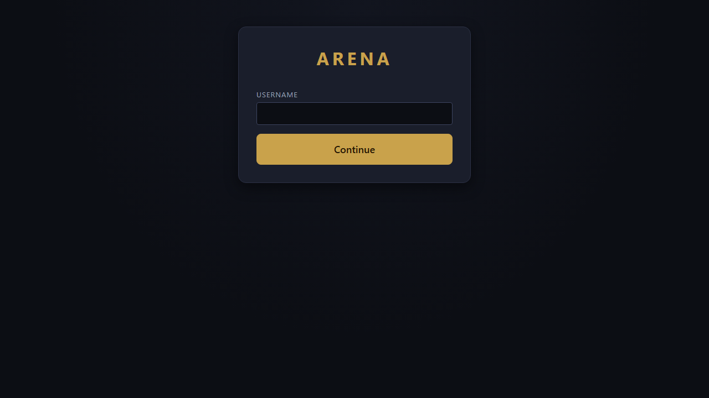

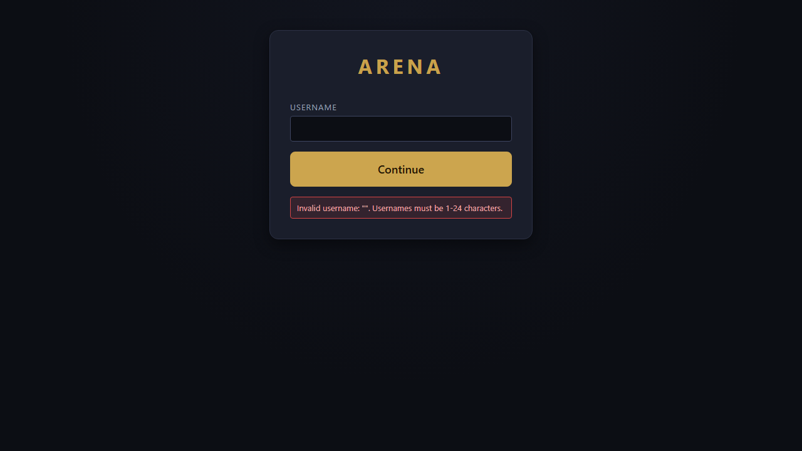

---

## Step 2 — Player Identification: success

**Cases:** AT-01 (R1.1, R1.3) · **Screen:** Lobby (idle)

Entering a valid username (`Alice`) and clicking **Continue** succeeds — no password or other credential
was ever requested (R1.3). The Lobby now shows "Welcome, Alice" with **Find Match** and **View Leaderboard**
controls.

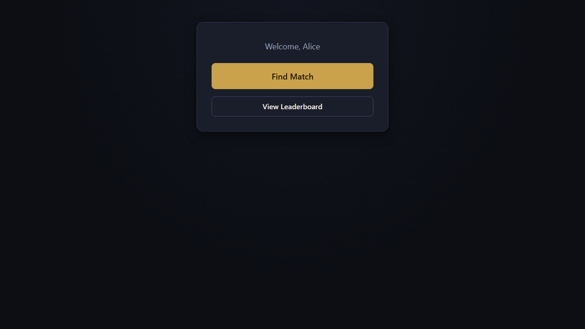

---

## Step 3 — Matchmaking Queue: joining

**Cases:** AT-05 (R2.1) · **Screen:** Lobby (queued)

Clicking **Find Match** adds Alice to the real first-in-first-out queue; the server's acknowledgment
reports her 1-based position, shown here as "Position in queue: 1" alongside a **Cancel** control (R2.3,
not separately screenshotted — exercised by the same button).

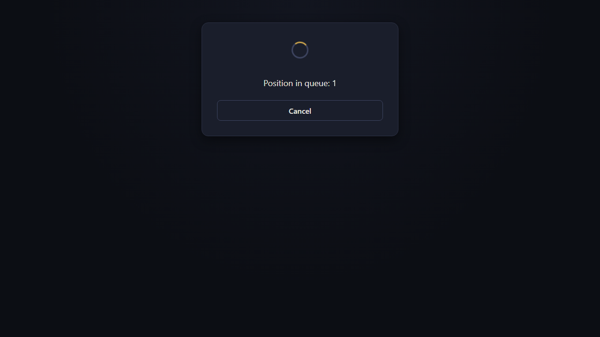

---

## Step 4 — Matchmaking Queue: pairing, and Champion Selection: the shared roster

**Cases:** AT-07 (R2.4, R2.6), AT-09 (R3.1) · **Screen:** Champion Select

A second player (`Bob`) identifies and joins the queue. Within about a second, the server pairs the two
longest-waiting players (R2.4) and both clients transition to Champion Select simultaneously (R2.6) —
Alice's screen (shown) reads "You: Alice / Opponent: Bob." Both clients render the identical fixed
three-champion roster — **Korr** (Bruiser/Control, 180 HP), **Vex** (Ranged Burst Mage, 85 HP), **Rin**
(Sustain Duelist, 130 HP) — each with matching listed abilities and cooldowns (R3.1), plus the 30-second
selection countdown (R3.4).

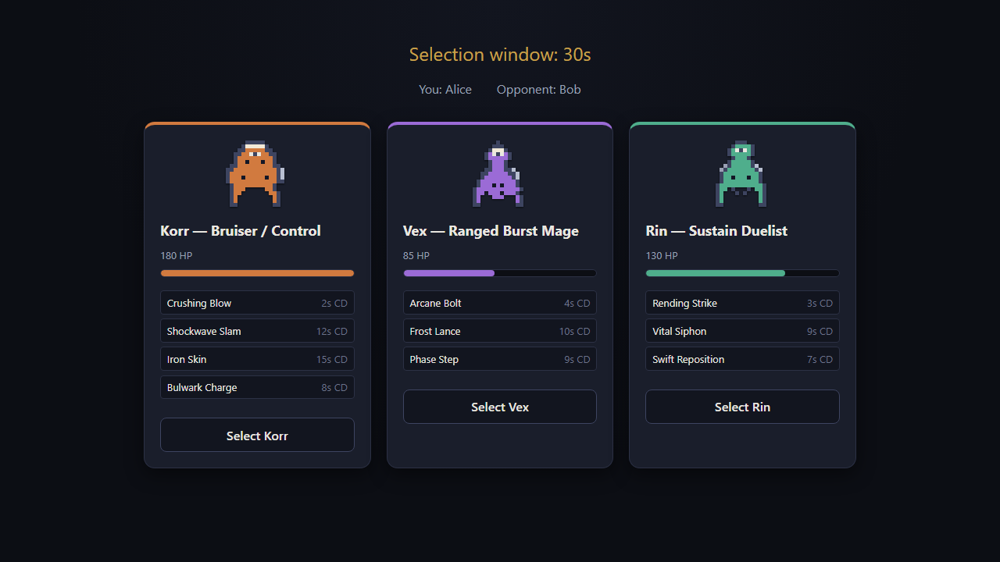

---

## Step 5 — Champion Selection: a selection broadcast in real time

**Cases:** AT-10 (R3.3) · **Screen:** Champion Select (after one selection)

Alice selects Vex. Her own screen immediately shows "You selected: vex" and her **Select Vex** button
becomes disabled — and per R3.3, this selection is broadcast to Bob's client as it occurs, with no action
required from Bob to see it update.

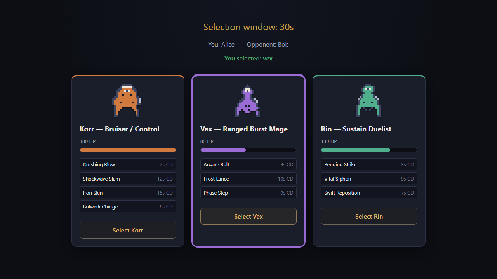

---

## Step 6 — Real-Time Combat: a valid ability hit, in flight

**Cases:** AT-11 (R3.5), AT-13 (R4.1, R4.7), AT-14 (R4.2, R4.3), AT-18 (R4.5, R4.6) · **Screen:** in-Match
HUD

Once Bob also selects Vex, both clients transition straight to the in-Match HUD (R3.5) — no further
confirmation step. Both players repositioned via real WASD input (R4.1, rendered with client-side
interpolation per R4.7), then Alice cast **Arcane Bolt** at Bob. This frame, captured mid-flight, shows the
real traveling cast-effect projectile (the small diamond between the two champions) and the ability's
cooldown chip (`arcane-bolt: 3.8s`) already registered on Alice's own HUD — the ability was validated
(range, cooldown, resource — R4.2), its cooldown/cost applied (R4.3), and the resulting state broadcast to
both clients (R4.5) all within the same simulation tick.

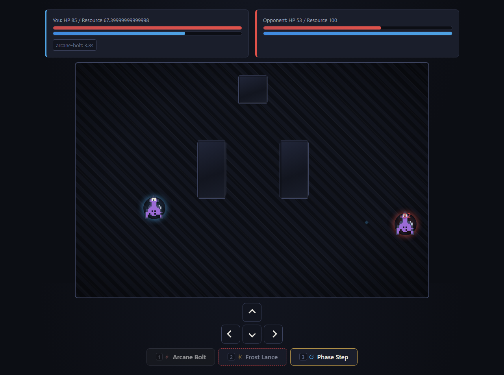

---

## Step 7 — Disconnect and Reconnect Handling: the disconnect banner

**Cases:** AT-22 (R6.1, R6.2) · **Screen:** in-Match HUD · **Pop-up:** disconnect banner

Bob's connection is dropped for real (not simulated at the application layer — a genuine network-level
disconnect). Within a few seconds, Alice's client — the only one still connected — shows the system's one
real transient pop-up: "Opponent disconnected — reconnecting in 30s" (R6.2). Bob's champion is held in
place; no further movement or ability use happens on his behalf for the rest of the grace period (R6.1).
Note the opponent's HP (53) reflects the Arcane Bolt landed in Step 6, carried over correctly.

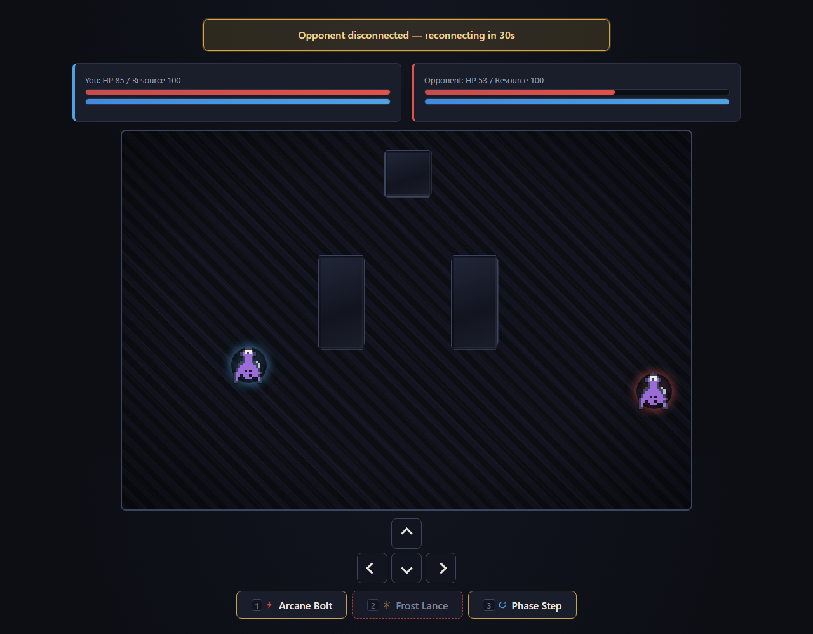

---

## Step 8 — Disconnect and Reconnect Handling: reconnection restores play

**Cases:** AT-23 (R6.3) · **Screen:** in-Match HUD (banner cleared)

Bob's connection is restored well within the 30-second grace period. The banner disappears from Alice's
screen and both players resume acting immediately — Alice lands a second Arcane Bolt here (opponent HP
53 → 21), proving match state was carried through the disconnect untouched (R6.3): no rollback, no reset,
no desync between the two clients.

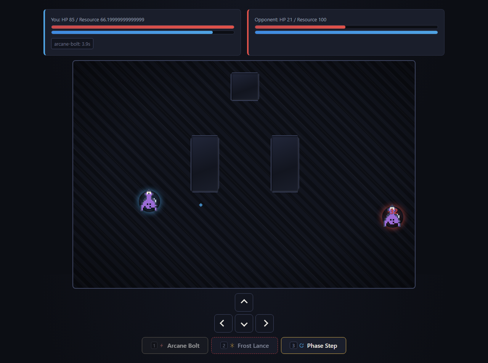

---

## Step 9 — Match Win Conditions: elimination and the Results screen

**Cases:** AT-19 (R5.1), AT-20 (R5.3) · **Screen:** Results

A third Arcane Bolt eliminates Bob (85 HP − 3×32 damage ≤ 0). The match ends immediately (R5.1), crediting
the win to Alice. Both clients independently render their own Results screen (R5.3): Alice's shows
**Victory**, Bob's shows **Defeat**, both agreeing on "Reason: Elimination" and the same match duration —
each screen computed its own outcome label by comparing the server's authoritative `winningTeam` against
that connection's own team, never asserting a result the server hadn't already decided (master context
§1.1).

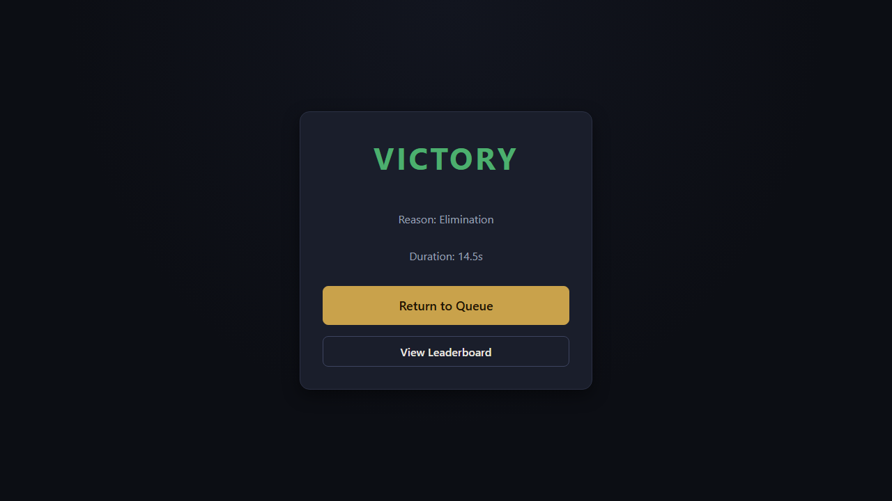

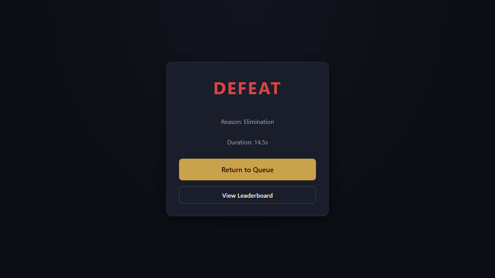

---

## Step 10 — Leaderboard

**Cases:** AT-27 (R8.1), AT-29 (R8.3) · **Screen:** Leaderboard

Clicking **View Leaderboard** from the Results screen fetches the real `GET /leaderboard` and
`GET /leaderboard/champions` endpoints. Alice — the only player with a completed win at this point in the
demonstration — ranks first at a 100.0% win rate; Bob appears with his 0.0% loss recorded (R8.1). The
Champion Win Rates section below shows Vex's aggregate record across both participants in this one match
(R8.3) — every number here was computed server-side from persisted match history, not by the client.

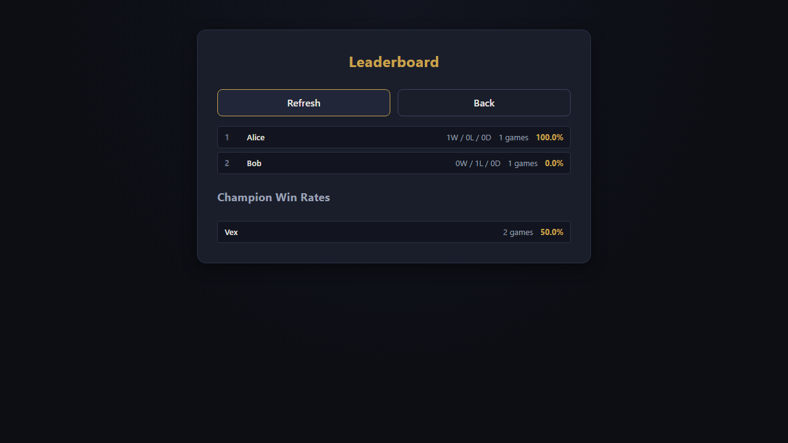

---

## Coverage summary

This one continuous execution directly demonstrated 16 of the 29 cataloged cases (AT-01, AT-02, AT-05,
AT-07, AT-09, AT-10, AT-11, AT-13, AT-14, AT-18, AT-19, AT-20, AT-22, AT-23, AT-27, AT-29) spanning all
eight SRS system features (3.2.1 through 3.2.8) and every
screen listed in SRS 3.1.1, plus the system's one real transient pop-up (the disconnect banner) and its one
inline error alert. The remaining cases in `docs/acceptance-test-cases.md` are either straightforward
variations reachable from the same screens by a human tester (e.g. cancelling the queue, an ability still
on cooldown), require several minutes of real wall-clock time to reach naturally (the 5-minute time limit,
the 30-second forfeit), or — per the SRS's own stated priorities — are verified at the REST layer or via
this project's existing automated test suites rather than through a client screen that was never built for
them (matching R7's own "Desired," not "Essential," priority for a client-side match-history view).
